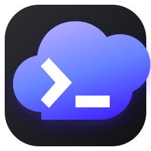
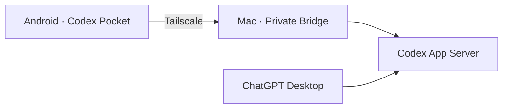

<p align="center">
  
</p>

<h1 align="center">Codex Pocket</h1>

<p align="center">
  在 Android 手机上，安全、流畅地远程使用 Mac 上的 Codex。
</p>

<p align="center">
  <a href="https://github.com/renshaojie233/codex-pocket/actions/workflows/ci.yml"></a>
  
  
  
</p>

Codex Pocket 是一个非官方的个人项目。手机通过 Tailscale 私有网络连接 Mac
上的轻量 Bridge；Bridge 与 ChatGPT 桌面端共享同一个 Codex App Server，
因此任务、消息、运行状态和引导消息可以双向同步。手机不保存 OpenAI 登录凭据。



## 功能

- 查看、新建、归档 Codex 任务，并自动打开到最新一轮消息。
- 手机缓存最近消息，打开即显示；向上滚动时按批加载更早历史。
- 实时同步回复、思考状态、工具进度，以及运行中的引导消息。
- 运行时实时展开进度、思考、命令与输出；最终回复出现后自动合并为一条可再次展开的折叠栏。
- 折叠栏显示浅色实时进度；网络切换时保留当前界面并静默恢复只读请求。
- 支持 Markdown、LaTeX 公式、手机图片上传、视频、全屏缩放和媒体保存。
- 选择模型、思考强度、Default / Plan、Goal 与 Fast 模式。
- 设置只读、工作区或完全访问权限；初始默认是完全访问。
- 管理自动化任务、查看账户用量，并接收完成通知与震动。

## 快速开始

### 1. 准备环境

- Mac 已安装并登录 [ChatGPT 桌面端](https://openai.com/chatgpt/desktop/)。
- Mac 和 Android 手机登录同一个 Tailscale 账户。
- Mac 已安装 Node.js 20 或更高版本。
- 构建 APK 需要 JDK 17 和 Android SDK 35。

### 2. 启动 Mac Bridge

```bash
git clone https://github.com/renshaojie233/codex-pocket.git
cd codex-pocket
npm --prefix bridge install
./bridge/scripts/install-launch-agent.sh
```

脚本会自动适配当前用户名、Node 路径和仓库位置，并让 Bridge 在 macOS 登录后
自动启动。首次启动会生成：

```text
bridge/data/config.json
```

其中包含 Mac 的 Tailscale 地址、端口和随机配对令牌。该文件已被 Git 忽略，
不要发送给其他人。

### 3. 构建并安装 APK

```bash
./scripts/build-android.sh
```

APK 会生成到：

```text
outputs/codex-pocket-0.15.3.apk
```

也可以在手机浏览器打开下面的私有下载页：

```text
http://<Mac 的 Tailscale IPv4>:8787/download
```

APK 接口支持 HTTP Range 与断点续传；移动网络中断后可直接在浏览器下载管理中继续。

安装后，在首次连接页面填写：

```text
地址：ws://<Mac 的 Tailscale IPv4>:8787/ws
令牌：bridge/data/config.json 中的 token
```

以后只要 Mac 已登录系统、Tailscale 在线，就可以直接从手机连接。

如果手机网络偶尔从 `direct` 退化到 DERP 中继，可以在安装开机服务时指定手机的
Tailscale 设备名，启用每两分钟一次的轻量直连检查：

```bash
CODEX_POCKET_TAILSCALE_PEER=<手机设备名> ./bridge/scripts/install-launch-agent.sh
```

检测到活跃手机持续使用 DERP 时，守护检查会刷新 Mac 的 UDP/STUN 端点并重新协商；
修复操作设有十分钟冷却时间，不会频繁重置连接。设备名只保存在本机 LaunchAgent 中。

## 常用命令

```bash
# 查看 Bridge 状态
curl http://<Mac 的 Tailscale IPv4>:8787/health

# 运行 Bridge 测试
npm --prefix bridge test

# 停止开机自启（配置会保留为 .disabled 备份）
./bridge/scripts/uninstall-launch-agent.sh
```

## 安全说明

- Bridge 默认只监听 Mac 的 Tailscale IPv4，并要求随机 Bearer Token。
- `ws://` 流量由 Tailscale 的 WireGuard 隧道加密；不要把端口转发到公网。
- `bridge/data/`、`android/local.properties`、`outputs/` 和本机专属图标均不会提交。
- 手机消息和图片位于应用私有缓存目录，总上限 1 GB；清理缓存不会影响 Mac 历史记录。
- “完全访问”会移除 Codex 本地沙箱限制，只应在可信任务中使用。

## 项目结构

```text
android/   Kotlin + Jetpack Compose 客户端
bridge/    Node.js WebSocket Bridge
scripts/   APK 构建脚本
```

> Codex、ChatGPT 及相关商标归 OpenAI 所有。本项目与 OpenAI 无隶属或背书关系。
